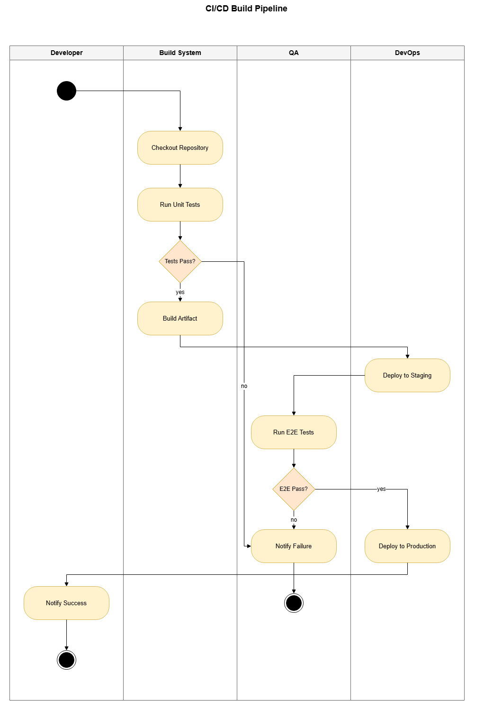
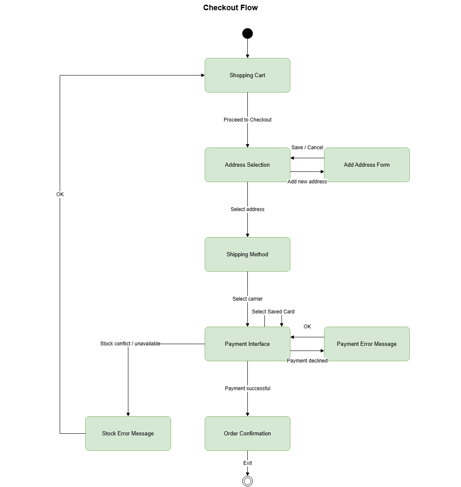
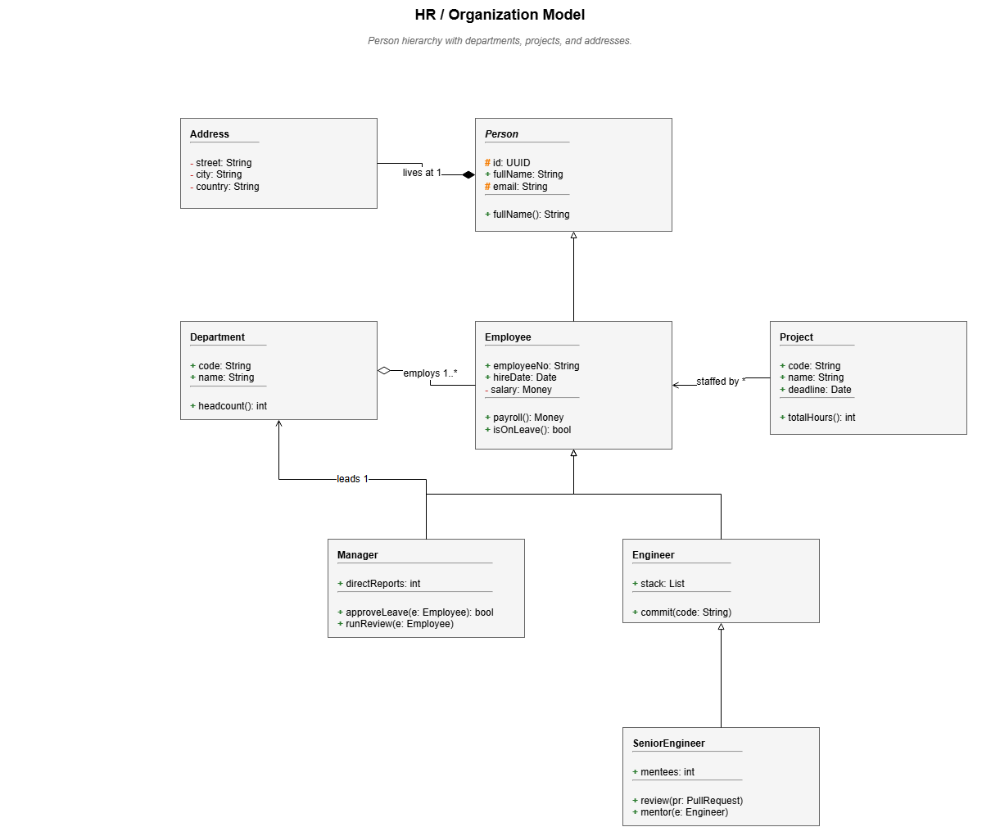
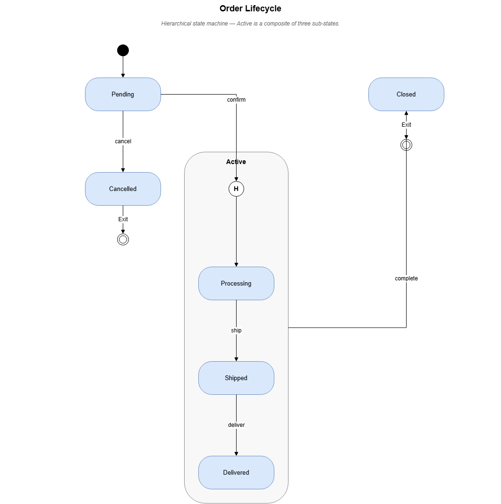
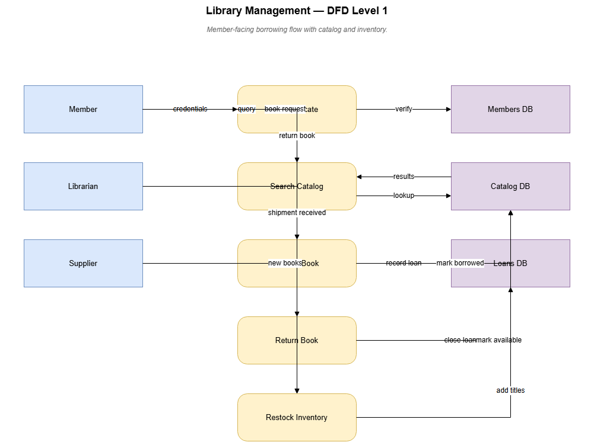
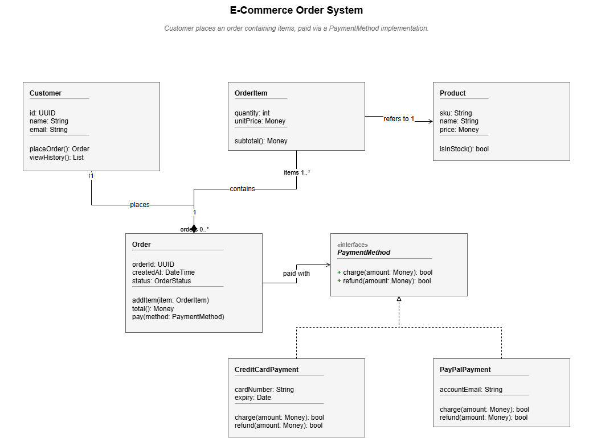

# irtool

> Validate, build, and render [draw.io](https://www.drawio.com/) diagrams from a concise YAML description.

```
YAML IR  ──▶  validate  ──▶  build  ──▶  .drawio  ──▶  render  ──▶  .png
              (schema +     (size +                    (headless
               semantic)     layout +                   Chrome /
                             emit)                      draw.io)
```

Six diagram types out of the box: **DFD**, **Class**, **State (STD)**, **Sequence**, **Activity**, and **Dialog**.

The IR spec lives in code, not prose — [`irtool/models.py`](irtool/models.py) (Pydantic) is the single source of truth.

---

## Examples

| CI/CD Build Pipeline (activity) | Checkout Flow (dialog) |
|:---:|:---:|
|  |  |

| HR / Organization Model (class) | Order Lifecycle (state) |
|:---:|:---:|
|  |  |

| Library Management DFD | E-Commerce Order System (class) |
|:---:|:---:|
|  |  |

---

## Install

```bash
# Core library + CLI
pip install -e .

# With MCP server (adds `irtool-mcp` console script)
pip install -e ".[mcp]"

# With dev tooling (pytest + Pillow for visual tests)
pip install -e ".[mcp,dev]"
```

Requires **Python 3.10+**.

---

## Quick start

```bash
# Validate a YAML file
python -m irtool check tests/ir/valid/dfd_minimal.yaml

# Build to .drawio XML
python -m irtool build tests/ir/valid/dfd_minimal.yaml --out diagram.drawio

# Build + render to PNG (requires the export server — see below)
python -m irtool build tests/ir/valid/dfd_minimal.yaml \
    --render --server http://localhost:8005

# Render an existing .drawio file
python -m irtool render diagram.drawio --server http://localhost:8005
```

---

## Export server (PNG rendering)

PNG rendering goes through jgraph's own headless draw.io renderer — the same engine `export.draw.io` uses. One-time setup on Windows:

```powershell
.\scripts\setup_export_server.ps1   # clones repo + npm install (pulls Chromium)
.\scripts\start_export_server.ps1   # starts server on http://localhost:8005
```

Then pass `--render --server http://localhost:8005` to any `irtool build` call, or set the env var:

```bash
export DRAWIO_EXPORT_URL=http://localhost:8005
```

For Docker or the hosted endpoint:

```bash
# Docker
docker run -d -p 8005:8000 jgraph/export-server
export DRAWIO_EXPORT_URL=http://localhost:8005

# Hosted (rate-limited, no setup)
export DRAWIO_EXPORT_URL=https://exp.draw.io/ImageExport4/export
```

---

## IR shape

Every diagram is a YAML file with a top-level `diagram:` key. The `type` field selects the diagram type; everything else follows from it.

### DFD

```yaml
diagram:
  type: dfd
  title: Login
  entities:
    - id: user
      type: external_entity
    - id: auth
      type: process
    - id: users_db
      type: store
  flows:
    - from: user
      to: auth
      label: credentials
    - from: auth
      to: users_db
      label: lookup
```

### Class

```yaml
diagram:
  type: class
  title: Order System
  classes:
    - id: order
      name: Order
      attributes: ["id: UUID", "status: String"]
      methods: ["total(): Money"]
    - id: item
      name: OrderItem
      attributes: ["quantity: int"]
  relationships:
    - from: order
      to: item
      type: composition
      label: contains
      target_multiplicity: "1..*"
```

### State (STD)

```yaml
diagram:
  type: std
  title: Order Lifecycle
  states:
    - id: pending
      is_initial: true
    - id: active
    - id: done
      is_final: true
  transitions:
    - from: pending
      to: active
      event: confirm
    - from: active
      to: done
      event: complete
```

### Sequence

```yaml
diagram:
  type: sequence
  title: Login Flow
  objects:
    - id: user
      type: actor
    - id: api
      type: boundary
    - id: auth
      type: control
  messages:
    - from: user
      to: api
      label: POST /login
    - from: api
      to: auth
      label: validate(token)
    - from: auth
      to: api
      label: ok
      type: return
```

### Activity

```yaml
diagram:
  type: activity
  title: CI/CD Pipeline
  swimlanes:
    - id: dev
      name: Developer
    - id: ci
      name: Build System
  activities:
    - id: start
      type: start
      swimlane: dev
    - id: build
      type: normal
      swimlane: ci
      name: Build Artifact
    - id: end
      type: end
      swimlane: ci
  transitions:
    - from: start
      to: build
    - from: build
      to: end
```

### Dialog

```yaml
diagram:
  type: dialog
  title: Checkout Flow
  dialogs:
    - id: cart
      is_initial: true
    - id: payment
    - id: confirmation
      is_final: true
  transitions:
    - from: cart
      to: payment
      trigger: Proceed
    - from: payment
      to: confirmation
      trigger: Pay
```

See [`tests/ir/valid/`](tests/ir/valid/) for one minimal fixture per type, and [`examples/`](examples/) for richer real-world diagrams.

---

## Validation

Three layers, run in order:

| Layer | What it checks |
|---|---|
| **Schema** | Pydantic: required fields, types, allowed values, no unknown keys (`extra="forbid"`) |
| **Semantic** | Duplicate IDs, dangling refs, orphan nodes, type-specific invariants (DFD forbidden flows, class inheritance cycles, STD must have exactly one initial state, sequence object ordering, …) |
| **Lint** | Warnings: missing final state in an STD, unreachable states, etc. |

Issue codes are stable strings (`orphan_node`, `dfd_store_to_store`, `inheritance_cycle`, …) — fixtures pin them so the validator can't silently regress.

---

## Tests

```bash
python -m pytest tests/
```

| Test file | What it covers |
|---|---|
| `test_validator.py` | Sweeps `tests/ir/{valid,invalid}/`; pins required issue codes |
| `test_build.py` | Every valid fixture must produce parseable XML with correct vertex/edge counts |
| `test_visual.py` | Renders fixtures and pixel-diffs against golden PNGs (skipped if export server is unreachable) |

**Adding a new validation rule:** write a fixture under `tests/ir/invalid/`, add an `.expected.json` listing required issue codes, implement the check in `semantic.py`.

Regenerate visual goldens after an intentional layout change:

```bash
IRTOOL_UPDATE_GOLDENS=1 python -m pytest tests/test_visual.py
```

---

## MCP server

`irtool` ships an [MCP](https://modelcontextprotocol.io/) server so any MCP client (Claude Desktop, Claude Code, Cursor, custom agents) can drive the validate / build / render pipeline directly.

```bash
irtool-mcp              # console script
python -m irtool_mcp    # equivalent
```

Configure your client:

```json
{
  "mcpServers": {
    "irtool": {
      "command": "irtool-mcp",
      "env": { "DRAWIO_EXPORT_URL": "http://localhost:8005" }
    }
  }
}
```

Tools exposed:

| Tool | Purpose |
|---|---|
| `list_diagram_types` | Catalog of supported types + IR shape per type |
| `get_example` | Minimal valid YAML skeleton for any type |
| `validate_diagram` | Schema + semantic validation; returns stable issue codes |
| `build_diagram` | YAML → draw.io XML |
| `render_diagram` | YAML → draw.io XML + base64 PNG |

---

## Project layout

```
irtool/
  models.py          Pydantic IR — single source of truth
  issues.py          Issue + IssueCode vocabulary
  semantic.py        Per-type semantic checks
  validate.py        YAML → schema → semantic pipeline
  render.py          Export-server client (PNG)
  cli.py             python -m irtool check|build|render
  build/
    __init__.py      Dispatcher on diagram type
    types.py         Shape, Connector, BuildResult dataclasses
    xml_emit.py      BuildResult → draw.io XML (no geometry logic)
    _common.py       Shared helpers (parallel edges, outside routing, pseudo-states)
    dfd.py           3-column layout
    class_.py        Hierarchical by inheritance
    state.py         BFS-layered with composite state support
    sequence.py      Lifelines + messages
    activity.py      Swimlane containers
    dialog.py        Spine-aware tree layout (reference implementation)

irtool_mcp/
  server.py          FastMCP server (5 tools)
  examples/          Bundled minimal YAML skeletons (shipped with package)

tests/
  test_validator.py
  test_build.py
  test_visual.py
  ir/
    valid/           One minimal fixture per diagram type
    invalid/         11 fixtures + .expected.json with required issue codes

examples/            Non-trivial reference diagrams + rendered outputs
scripts/             PowerShell helpers for the export server (Windows)
```

---

## License

[MIT](LICENSE)
